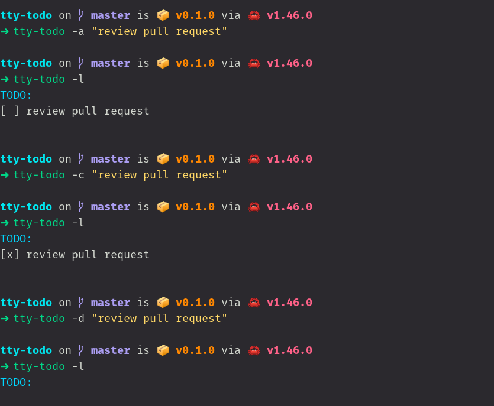

# tty-todo 
📝 A terminal todo list.
<br>
<br>


## 🔌 Installation
```sh
cargo install tty-todo
```

**or**

Install the [latest release](https://github.com/raad1masum/tty-todo/releases).

## 🕹 Usage

### Help: 
```sh
tty-todo -h
```

### List Tasks: 
```sh
tty-todo -l
```

### Add Task: 
```sh
tty-todo -a <TASK>
```

### Complete Task: 
```sh
tty-todo -c <TASK>
```

### Delete Task: 
```sh
tty-todo -d <TASK>
```

## 🚀 Local Development
```sh
git clone https://github.com/raad1masum/tty-todo.git
cargo install
cargo build
```

## 👨‍💻 Contact

Linkedin: [Raadwan Masum](https://www.linkedin.com/in/raadwan-masum-9147bb1a5)
<br>
Github: [raad1masum](https://github.com/raad1masum)
<br>
Devpost: [Raadwan masum](https://devpost.com/raad1masum)
